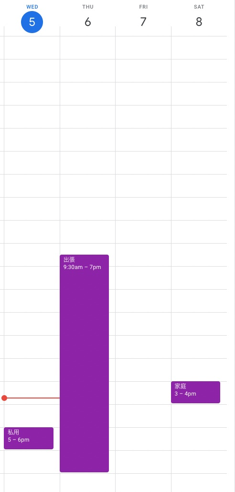

# Auto-Update-of-Shared-GCal
複数のGoogleカレンダー上の予定を集約して，一つの共有用カレンダーを作成します．  
保存していたカレンダー単位で新たに共有用の名前をつけて公開することができます．  
 ->   
(自分が記入したカレンダー) -> (アプリが出力するカレンダー)

# 使い方
よく理解した上でご利用ください．本プログラムの利用に伴うトラブルについて一切の責任を負いかねます．
1. [Google ドライブ](https://drive.google.com/drive/u/0/my-drive)にアクセス
2. 任意のフォルダを作成/移動し，新規 > その他 > Google Apps Script を作成・IDEの起動  
    
3. [main.js](main.js)の内容を貼り付け
4. 共有するカレンダーの設定を行う
   1. [Google Calendar](https://calendar.google.com/calendar/u/0/r)にアクセス
   2. 共有するカレンダーを作成  
        
   3. 共有するカレンダーの設定欄から，Calender IDを確認して，[main.js](main.js)の`OUT_CAL_ID`に貼り付け  
        ```js:main.js
        const OUT_CAL_ID = "shareshare@group.calendar.google.com";  // 共有用
        ```
          
   自分で作成したカレンダーは`<記号列>@group.calendar.google.com`というIDが自動的に割り振られる．
   1. 同様に共有元となるカレンダーの設定欄から，Calender IDを確認して，[main.js](main.js)の`IN_CAL_ID`に貼り付け  
        ```js:main.js
        const IN_CAL_ID = [
            "hogehoge@gmail.com",  // メインのカレンダー
            "fugafuga1234@group.calendar.google.com",  // 仕事のカレンダー
            "foofoo@gmail.com"  // 家族との共有カレンダー
        ];
        ```  
        アカウント標準カレンダーのCalender IDはGMailアドレスに一致する  
        アクセス権限があれば，自分以外のアカウントのカレンダーも参照可能
    1. [main.js](main.js)の`IN_CAL_NAMES`に各カレンダーの公開名を入力．順番はCalender IDの順番と一致させる
    2. (Optional) 必要であれば[main.js](main.js)の`IGNORE_EVENTS_TITLE`に共有対象にしないイベント名を記入  
    3. (Optional) 必要であれば[main.js](main.js)の`decide_new_event_title`に特別な置換ルールを記入
 5. IDE上の実行ボタンをクリック
 6. ポップアップ上の「権限を確認」をクリックし，スクリプトを作成中のGoogleアカウントでログイン  
    
 7. 自作のスクリプトのため警告が表示される．左下の「詳細」から「｛プロジェクト名｝(安全ではないページ)に移動」をクリック  
    
 8. カレンダーの権限を承認  
    
 9. 再度「実行」をクリック
 10. カレンダーに移動して反映を確認  
 11. 共有用カレンダーを適宜共有する
 12. (Optinonal) トリガーの追加ページから，毎日決まった時間に実行 / カレンダーに変更があれば実行 など自動実行を設定  
      
    ※GASは1日あたりの実行数制限があるので要注意  
    (例)私のトリガー  
      
    - 各カレンダーが変更されたら`on_cal_changed`を実行  
    - 1日に1回，`daily_run`を実行(実行失敗した処理があるとカレンダーが乱れているため)

# コード解説
そのうちします．


# 参考リンク
- 複数のGoogleカレンダーをまとめる - Qiita https://qiita.com/k6s4/items/f7d8a3baa095b97ac0de
- 複数の Google Calendar をまとめた Calendar を Google Apps Script を利用して作成する - KainokiKaede's diary https://kainokikaede.hatenablog.com/entry/2016/07/27/164629